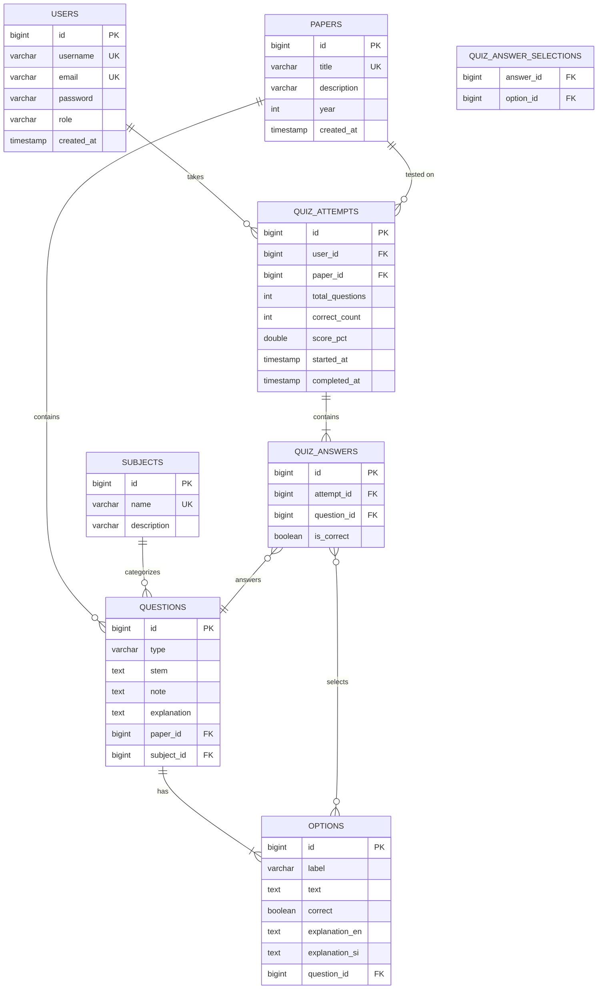

# Pharmacy Past-Paper Quiz Backend — Implementation Plan

Build a complete Spring Boot REST API for a pharmacy exam quiz system with JWT auth, question management (CRUD), paper/subject grouping, quiz attempt & scoring, and bilingual support (English + Sinhala).

## Tech Stack

| Layer | Technology |
|---|---|
| Framework | Spring Boot 4.1.0 |
| Database | PostgreSQL + Spring Data JPA |
| Auth | Spring Security + JWT (jjwt) |
| Build | Gradle |
| Java | 17 |
| Other | Lombok, Bean Validation |

---

## Proposed Changes

### 1. Build Configuration

#### [MODIFY] [build.gradle](file:///d:/medicine%20select/New/pp_backen/build.gradle)
Add dependencies:
- `spring-boot-starter-web` — REST controllers
- `spring-boot-starter-data-jpa` — JPA / Hibernate
- `spring-boot-starter-security` — Spring Security
- `spring-boot-starter-validation` — Bean Validation
- `org.postgresql:postgresql` — PostgreSQL driver
- `io.jsonwebtoken:jjwt-api`, `jjwt-impl`, `jjwt-jackson` — JWT handling

#### [MODIFY] [application.properties](file:///d:/medicine%20select/New/pp_backen/src/main/resources/application.properties)
Configure PostgreSQL datasource, JPA/Hibernate DDL, JWT secret, and server port.

---

### 2. Database Entity Model



#### Entity Files (all [NEW]):

| File | Description |
|---|---|
| `entity/User.java` | User account with role-based access |
| `entity/Paper.java` | Past-paper grouping (year, title) |
| `entity/Subject.java` | Subject/topic categorization |
| `entity/Question.java` | Question with stem, type (tf/single/multi), links to Paper & Subject |
| `entity/Option.java` | Answer option with bilingual explanations |
| `entity/QuizAttempt.java` | A user's quiz session with scoring |
| `entity/QuizAnswer.java` | Individual answer within an attempt |

---

### 3. Security & Authentication

#### [NEW] Files:

| File | Purpose |
|---|---|
| `security/JwtTokenProvider.java` | Generate & validate JWT tokens |
| `security/JwtAuthenticationFilter.java` | Extract JWT from `Authorization` header, set SecurityContext |
| `security/SecurityConfig.java` | Configure filter chain, public/protected endpoints |
| `dto/auth/RegisterRequest.java` | Registration DTO |
| `dto/auth/LoginRequest.java` | Login DTO |
| `dto/auth/AuthResponse.java` | JWT token response |
| `controller/AuthController.java` | `POST /api/auth/register`, `POST /api/auth/login` |

**Public endpoints:** `/api/auth/**`  
**Protected endpoints:** Everything else (requires valid JWT)

---

### 4. Repositories (Spring Data JPA)

All [NEW] — standard `JpaRepository` interfaces:

| Repository | Key Custom Queries |
|---|---|
| `UserRepository` | `findByUsername()`, `existsByEmail()` |
| `PaperRepository` | standard CRUD |
| `SubjectRepository` | standard CRUD |
| `QuestionRepository` | `findByPaperId()`, `findBySubjectId()`, random question selection |
| `OptionRepository` | `findByQuestionId()` |
| `QuizAttemptRepository` | `findByUserId()`, `findByUserIdAndPaperId()` |
| `QuizAnswerRepository` | `findByAttemptId()` |

---

### 5. Services & Controllers

#### Question Management (CRUD)
| File | Endpoints |
|---|---|
| `service/QuestionService.java` | Business logic for CRUD |
| `controller/QuestionController.java` | `GET/POST/PUT/DELETE /api/questions/**` |
| `dto/question/QuestionRequest.java` | Create/update DTO |
| `dto/question/QuestionResponse.java` | Response DTO with nested options |

#### Paper & Subject Management
| File | Endpoints |
|---|---|
| `service/PaperService.java` | Paper CRUD |
| `controller/PaperController.java` | `GET/POST/PUT/DELETE /api/papers/**` |
| `service/SubjectService.java` | Subject CRUD |
| `controller/SubjectController.java` | `GET/POST/PUT/DELETE /api/subjects/**` |

#### Quiz Attempt & Scoring
| File | Endpoints |
|---|---|
| `service/QuizService.java` | Start quiz, submit answers, calculate score |
| `controller/QuizController.java` | `POST /api/quiz/start`, `POST /api/quiz/{id}/submit`, `GET /api/quiz/attempts` |
| `dto/quiz/StartQuizRequest.java` | Paper ID, number of questions |
| `dto/quiz/QuizResponse.java` | Questions for the quiz (no correct answers) |
| `dto/quiz/SubmitQuizRequest.java` | User's selected answers |
| `dto/quiz/QuizResultResponse.java` | Score, per-question results with explanations |

---

### 6. Data Seeding

#### [NEW] `config/DataSeeder.java`
- Runs on startup via `CommandLineRunner`
- Parses the provided JSON question data
- Creates a default Paper ("Pharmacy Past Paper")
- Seeds all questions and options into PostgreSQL
- Idempotent (checks if data already exists)

#### [NEW] `src/main/resources/data/questions.json`
- The full question dataset provided by the user, stored as a resource file

---

### 7. Exception Handling

#### [NEW] `exception/GlobalExceptionHandler.java`
- `@RestControllerAdvice` for consistent error responses
- Handles `ResourceNotFoundException`, validation errors, auth errors

#### [NEW] `exception/ResourceNotFoundException.java`
- Custom 404 exception

---

## API Summary

| Method | Endpoint | Auth | Description |
|---|---|---|---|
| `POST` | `/api/auth/register` | ❌ | Register a new user |
| `POST` | `/api/auth/login` | ❌ | Login, get JWT |
| `GET` | `/api/papers` | ✅ | List all papers |
| `POST` | `/api/papers` | ✅ ADMIN | Create paper |
| `GET` | `/api/subjects` | ✅ | List all subjects |
| `POST` | `/api/subjects` | ✅ ADMIN | Create subject |
| `GET` | `/api/questions` | ✅ | List questions (filter by paper/subject) |
| `GET` | `/api/questions/{id}` | ✅ | Get question with options |
| `POST` | `/api/questions` | ✅ ADMIN | Create question |
| `PUT` | `/api/questions/{id}` | ✅ ADMIN | Update question |
| `DELETE` | `/api/questions/{id}` | ✅ ADMIN | Delete question |
| `POST` | `/api/quiz/start` | ✅ | Start a quiz attempt |
| `POST` | `/api/quiz/{id}/submit` | ✅ | Submit answers & get score |
| `GET` | `/api/quiz/attempts` | ✅ | Get user's quiz history |
| `GET` | `/api/quiz/attempts/{id}` | ✅ | Get detailed attempt results |

---

## Project Package Structure

```
com.local.pp_backen/
├── PpBackenApplication.java
├── config/
│   └── DataSeeder.java
├── controller/
│   ├── AuthController.java
│   ├── PaperController.java
│   ├── SubjectController.java
│   ├── QuestionController.java
│   └── QuizController.java
├── dto/
│   ├── auth/
│   │   ├── RegisterRequest.java
│   │   ├── LoginRequest.java
│   │   └── AuthResponse.java
│   ├── question/
│   │   ├── QuestionRequest.java
│   │   ├── OptionRequest.java
│   │   ├── QuestionResponse.java
│   │   └── OptionResponse.java
│   └── quiz/
│       ├── StartQuizRequest.java
│       ├── QuizResponse.java
│       ├── SubmitQuizRequest.java
│       ├── AnswerSubmission.java
│       └── QuizResultResponse.java
├── entity/
│   ├── User.java
│   ├── Paper.java
│   ├── Subject.java
│   ├── Question.java
│   ├── Option.java
│   ├── QuizAttempt.java
│   └── QuizAnswer.java
├── exception/
│   ├── GlobalExceptionHandler.java
│   └── ResourceNotFoundException.java
├── repository/
│   ├── UserRepository.java
│   ├── PaperRepository.java
│   ├── SubjectRepository.java
│   ├── QuestionRepository.java
│   ├── OptionRepository.java
│   ├── QuizAttemptRepository.java
│   └── QuizAnswerRepository.java
├── security/
│   ├── JwtTokenProvider.java
│   ├── JwtAuthenticationFilter.java
│   └── SecurityConfig.java
└── service/
    ├── AuthService.java
    ├── PaperService.java
    ├── SubjectService.java
    ├── QuestionService.java
    └── QuizService.java
```

---

## Open Questions

> [!IMPORTANT]
> **PostgreSQL Connection Details** — Please provide your PostgreSQL connection info (host, port, database name, username, password). I'll use sensible defaults (`localhost:5432/pp_backen_db`) if not specified.

> [!NOTE]
> **Question Types** — Your data has `tf` (true/false per option) and `single` (single best answer). The model supports both plus `multi` (multiple select). Should I add any other question types?

---

## Verification Plan

### Automated Tests
```bash
./gradlew test
```

### Manual Verification
1. Start the application and verify it connects to PostgreSQL
2. Verify data seeder populates all 40+ questions from the JSON
3. Test auth flow: register → login → get JWT
4. Test question CRUD endpoints with JWT
5. Test quiz flow: start → submit → view results
